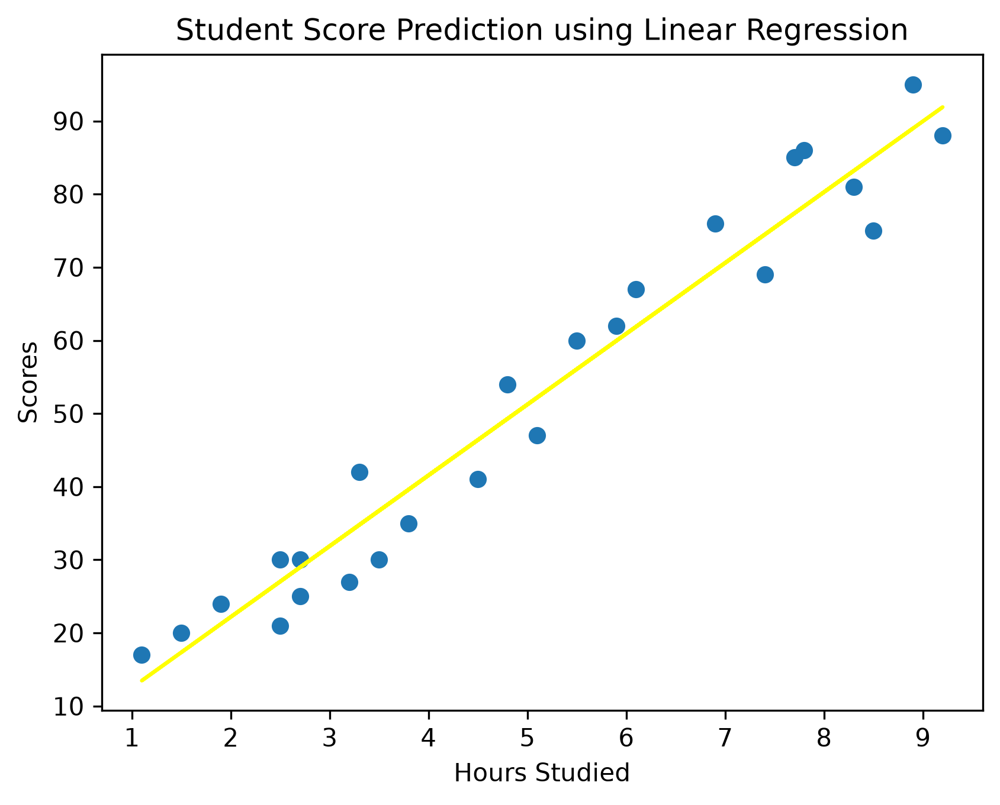

# 📊 Student Score Prediction using Linear Regression

## 📌 Project Overview
This project predicts a student's exam score based on the number of hours studied using the Linear Regression algorithm.

## 🎯 Objective
To understand the complete Machine Learning workflow, from loading data to making predictions and evaluating the model.

## 🛠️ Technologies Used
- Python
- Pandas
- NumPy
- Matplotlib
- Scikit-learn

## 📂 Project Workflow
1. Import libraries
2. Load dataset
3. Explore dataset
4. Select features
5. Split data into training and testing sets
6. Train Linear Regression model
7. Make predictions
8. Evaluate using MAE, MSE, and R² Score
9. Visualize the best-fit regression line

## 📈 Model Performance

- Mean Absolute Error (MAE): **3.92**
- Mean Squared Error (MSE): **18.94**
- R² Score: **0.9678**

## 📷 Output
(Add a screenshot of your graph here later.)

## 🚀 Future Improvements
- Try multiple regression
- Compare with other regression algorithms
- Deploy the model using Flask or FastAPI

## 📷 Output

## 👩‍💻 Author
Thanvitha Reddy